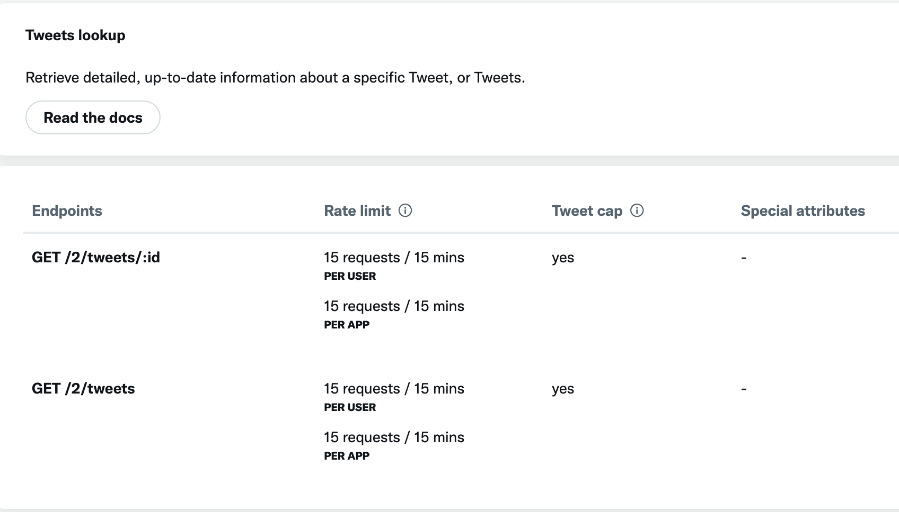

# Script para retribuir tweets por ID

## Resumo

Foi pedido a criação de um script que retribui tweets por ID, ou seja, que dado um ID de um tweet, o script devolve o tweet correspondente.
No entnato, a API do X (Twitter) é paga e não há possibilidade de aceder gratuitamente tweets pelo ID.

O acesso aos tweets pelo ID requer uma assinatura paga na API do Twitter. Na imagem seguinte vemos a documentação da API do Twitter e as opções disponíveis para aceder aos tweets.

